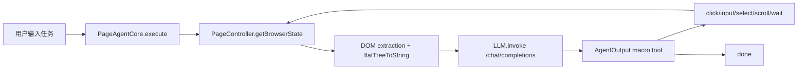

# Page Agent 集成到 indofun-aigc-v1.8 的评估报告

> 评估日期：2026-06-24  
> Page Agent 仓库：`/Users/indofun/Developer/page-agent`  
> 目标项目只读参考：`/Users/indofun/Developer/indofun-aigc-v1.8/integration`

## 结论

Page Agent **适合以“前端页面内操作助手”的方式灰度嵌入 v1.8**，但不适合直接作为 v1.8 的后端 agent runtime 或批量自动化引擎。

推荐第一阶段只做一个受控 POC：在 v1.8 已登录工作台内开启 Page Agent，让用户用自然语言完成“跳转页面、填写表单、选择模型、发起常规创作、查看历史”等低风险 UI 操作。不要一开始开放管理端钱包、账号管理、积分调整、系统设置等高权限区域。

必须先满足三个安全前提：

1. LLM Key 只放服务端，浏览器通过 v1.8 后端 `/api/page-agent/llm-proxy` 代理请求。
2. 使用 `transformPageContent` 对页面文本做脱敏；钱包、账号、Token、RequestId、URL 签名等敏感内容不能原样进入 LLM。
3. 使用 `interactiveBlacklist` / 页面 allowlist 限制可点击区域；默认禁止管理端写操作和破坏性按钮。

## Page Agent 是什么

Page Agent 是一个“住在网页里的 GUI agent”。它不依赖浏览器扩展、Python、Playwright 或服务端无头浏览器；核心能力运行在当前网页的 JavaScript 上。

它的基本工作方式是：

1. 在浏览器里读取当前页面 DOM。
2. 把可见文本和可交互元素压缩成带 index 的文本，例如 `[12]<button>生成 />`。
3. 把页面文本、用户任务、历史步骤发给 OpenAI-compatible LLM。
4. 强制 LLM 通过一个宏工具输出 reflection + action。
5. 执行点击、输入、选择、滚动、等待等 DOM 操作。
6. 重复 observe -> think -> act，直到 `done` 或超过步数。

这个设计决定了它更像“前端 Copilot 操作层”，不是 v1.8 现有 OpenClaw 智能体的替代品。

## 代码架构

Page Agent 是 npm workspaces monorepo，当前版本 `1.10.0`。

| 包 | 作用 | 关键文件 |
| --- | --- | --- |
| `page-agent` | 对外主入口，带 UI Panel 和 PageController | `packages/page-agent/src/PageAgent.ts` |
| `@page-agent/core` | Agent 循环、历史、工具、prompt、生命周期 | `packages/core/src/PageAgentCore.ts` |
| `@page-agent/llms` | OpenAI-compatible LLM client、重试、工具调用校验 | `packages/llms/src/index.ts`, `OpenAIClient.ts` |
| `@page-agent/page-controller` | DOM 提取、元素索引、点击/输入/滚动、遮罩 | `packages/page-controller/src/PageController.ts` |
| `@page-agent/ui` | 页面底部控制面板、历史渲染、ask_user 输入 | `packages/ui/src/panel/Panel.ts` |
| `@page-agent/ext` | Chrome 扩展，多标签控制 | `packages/extension/src/agent/MultiPageAgent.ts` |
| `@page-agent/mcp` | 让外部 MCP client 控制浏览器扩展 | `packages/mcp/README.md` |

核心运行链路：



## 关键能力

- 页面内自然语言操作：点击按钮、填写输入框、选择下拉、滚动页面、等待加载。
- DOM 文本化：不需要截图和多模态模型，适合管理后台、SaaS、表单密集页面。
- 自带 UI Panel：可显示执行历史、当前状态、用户追问。
- 自定义工具：可覆盖或新增工具，例如接 v1.8 的业务 API。
- 生命周期钩子：`onBeforeTask`、`onBeforeStep`、`onAfterStep`、`onAfterTask` 可记录审计或控制状态。
- 内容脱敏钩子：`transformPageContent` 可在 DOM 文本发给 LLM 前过滤。
- 后端代理支持：官方文档推荐生产环境用 `baseURL: '/api/llm-proxy'` + `customFetch`，避免前端泄露 API Key。
- 可视遮罩：通过 `enableMask` 阻止用户在自动化期间同时操作页面。

## 重要限制

- 默认 DOM 提取在当前源码里是全页提取：`viewportExpansion` 未设置时解析为 `-1`，会把全页可见文本送入 LLM。
- 数据脱敏不是默认能力：源码里仍有 `@todo 数据脱敏过滤器`，必须由接入方实现。
- 只能操作当前页面 DOM；跨标签能力依赖 Chrome 扩展，不适合作为第一阶段嵌入方案。
- 对复杂富文本编辑器、虚拟列表、复杂弹窗、canvas、shadow DOM、文件上传等场景需要专项验证。
- `execute_javascript` 是实验工具，可能绕过安全边界；v1.8 初期应保持关闭。
- Agent 成功率取决于页面可访问性文本、按钮语义、加载状态和模型工具调用稳定性。

## v1.8 现状

目标项目 `indofun-aigc-v1.8/integration` 是静态前端 + Express 后端：

- 前端：`web/index.html`、`web/js/app.js`、`web/js/features/*`、`web/styles/app.css`。
- 后端：`server/src/index.js` 挂载 auth、jobs、wallet、profile、assets、openclaw、text-models 等路由。
- 已有 AI 智能体页：`web/js/features/agent.js` 调 `/api/openclaw/*`，后端 `routes/openclaw.js` 代理 OpenClaw Gateway。
- 已有架构约束：新前端能力应落到 `web/js/features/*`，`web/js/app.js` 只做启动编排和 controller wiring。
- 运行态按既有记忆和 README：integration 默认 `4800:4800`，独立于 v1.5 `3800`。

Page Agent 和 v1.8 的匹配点：

| v1.8 场景 | 适配度 | 原因 |
| --- | --- | --- |
| 创作页表单填写、模型选择、生成提交 | 高 | DOM 表单密集，Page Agent 正擅长 |
| 历史记录、素材库、收藏查看 | 中高 | 以导航和筛选为主，风险可控 |
| 文本模型、公会话术页面 | 中 | 需要避免把用户文本和历史记录过量送入 LLM |
| OpenClaw 智能体页 | 中 | 可辅助 UI 操作，但不应替代后端 OpenClaw 对话链路 |
| 管理控制台只读统计 | 中 | 可灰度开放只读查询和跳转 |
| 积分管理、账号管理、系统设置 | 低，初期禁用 | 涉及资金、权限、审计和破坏性操作 |

## 推荐集成方案

### 阶段 0：只做评估，不改 v1.8 业务

在 Page Agent 仓库先沉淀方案和接入清单。不要直接把 CDN demo script 塞进 v1.8 生产页面。

### 阶段 1：受控 POC

目标：在 v1.8 integration 的普通用户工作台提供一个“页面操作助手”入口。

建议文件落点：

- 前端新增：`web/js/features/pageAgentAssistant.js`
- 前端接线：`web/index.html` 增加自托管 Page Agent script 和 feature script
- 启动接线：`web/js/app.js` 只创建/初始化 controller，不写业务逻辑
- 后端新增：`server/src/routes/pageAgent.js`
- 后端挂载：`server/src/index.js` 使用 `requireAuth` + `requireActiveAccount`
- 配置新增：`PAGE_AGENT_ENABLED`、`PAGE_AGENT_LLM_BASE_URL`、`PAGE_AGENT_LLM_MODEL`、`PAGE_AGENT_LLM_API_KEY`

推荐前端配置：

```js
const agent = new window.PageAgent({
  language: 'zh-CN',
  baseURL: '/api/page-agent/llm-proxy',
  model: 'configured-by-server',
  apiKey: 'NA',
  maxSteps: 20,
  enableMask: true,
  experimentalScriptExecutionTool: false,
  viewportExpansion: 0,
  customFetch: (url, init) => fetch(url, { ...init, credentials: 'include' }),
  transformPageContent: maskVodAigcPageContent,
  interactiveBlacklist: [
    () => document.querySelector('[data-page-agent-blocked]'),
    ...resolveDangerousControls(),
  ].filter(Boolean),
  instructions: {
    system: [
      'You are operating inside Indofun AIGC Studio.',
      'Never change wallet, user, admin, or system settings.',
      'Ask the user before submitting generation tasks.',
    ].join('\n'),
  },
});
```

### 阶段 2：业务工具增强

如果 POC 稳定，再考虑通过 `customTools` 增加 v1.8 专属工具，例如：

- `switch_view`：调用 v1.8 router 切换页面，减少盲点点击。
- `fill_generation_prompt`：只写 prompt，不直接提交。
- `quote_generation_cost`：调用钱包 quote API，只读报价。
- `open_recent_job`：按任务 ID 打开历史详情。

这类工具比让 LLM 盲点 DOM 更可控，也更容易审计。

### 阶段 3：可选扩展/MCP

Chrome extension + MCP 适合外部桌面 AI 控制浏览器，不适合作为 v1.8 产品内置第一阶段。除非后续目标是“让 Codex/Claude 控制管理员浏览器做运维动作”，否则不要优先接这条线。

## 安全边界

必须阻止以下内容进入 LLM：

- JWT、Cookie、localStorage token。
- 用户手机号、邮箱、密码、密钥、API Key。
- COS 临时签名 URL 或下载 URL。
- 钱包余额明细、充值/扣费流水、管理员账号列表。
- 上游 RequestId、错误堆栈、内部部署路径。
- 未经授权的用户作品、附件 URL、历史 prompt。

必须阻止以下操作被 Page Agent 自动点击：

- 删除任务、批量删除、清空历史。
- 积分发放、扣减、调整规则、强制结算/释放。
- 新增/禁用/删除账号、重置密码。
- 修改 API Key、系统配置、OpenClaw agent 白名单。
- 任何生产支付、退款、充值确认动作。

建议所有危险按钮加统一标记：

```html
<button data-page-agent-not-interactive data-page-agent-blocked="wallet-adjust">调整积分</button>
```

`PageController.updateTree()` 已经会把 `[data-page-agent-not-interactive]` 放入交互黑名单。

## 验收标准

POC 通过的最小标准：

1. 普通用户登录后可打开助手，完成“切换到创作页 -> 填 prompt -> 选择模型 -> 停在提交前确认”。
2. LLM 请求不包含 JWT、完整手机号/邮箱、钱包流水、COS 签名 URL。
3. 管理端、钱包、账号管理、系统设置的危险按钮不会出现在可交互 index 中。
4. 服务端 proxy 只允许已登录活跃用户调用，API Key 不出现在前端 bundle、HTML、localStorage 或网络响应。
5. `experimentalScriptExecutionTool` 保持关闭。
6. `maxSteps`、超时、错误提示、审计日志可观察。
7. 关闭 `PAGE_AGENT_ENABLED=0` 后前端入口消失，后端 proxy 返回不可用。

## 综合判断

Page Agent 对 v1.8 有价值，尤其适合把“复杂后台里的多步 UI 操作”变成自然语言入口。它的最大风险不是技术接不进去，而是默认会把页面内容交给 LLM，并且可以点击页面上的真实按钮。

因此，正确策略不是“全站接入”，而是：

1. 先在普通创作链路做小范围 POC。
2. 用后端 LLM proxy 管住 Key 和身份。
3. 用脱敏、allowlist、blacklist 管住页面内容和动作。
4. 稳定后再逐步引入 v1.8 专属 custom tools，把关键动作从 DOM 盲点升级为可审计 API 调用。
